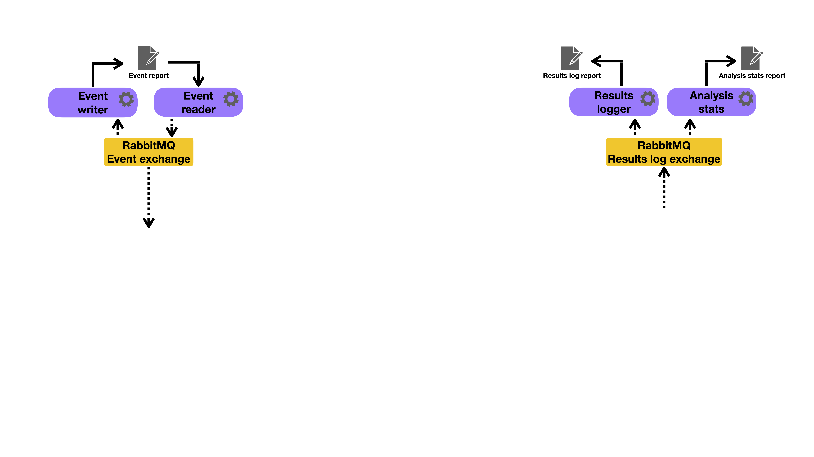

# The Runtime Toolbox
This project contains an implementation of several (less significant) agents of the RT-Constellation under the name Runtime Toolbox (RT). The rationale behind these tools is that they allow some useful interactions with the main agents (i.e., the [Runtime Reporter](https://github.com/invap/rt-reporter "The Runtime Reporter") and the [Runtime Monitor](https://github.com/invap/rt-monitor "The Runtime Monitor")). The agents are:
1. the [Runtime Event writer](https://github.com/invap/rt-toolbox/tree/main/rt_toolbox/rt_events_writer "The Runtime Event writer"): implements a tool that reads a *stream of events* obtained through the RabbitMQ events exchange, found in the RabbitMQ server configuration file, and writes them to a file in CSV format (see Section [Relevant information about the implementation)](https://github.com/invap/rt-reporter/blob/main/README.md#relevant-information-about-the-implementation) for details on how events reported by the *System Under Test* (SUT), are received by the Runtime Reporter) where each line represents a single event,
2. the [Runtime Event reader](https://github.com/invap/rt-toolbox/tree/main/rt_toolbox/rt_events_reader "The Runtime Event reader"): implements a tool that reads a file in CSV format (see Section [Relevant information about the implementation)](https://github.com/invap/rt-reporter/blob/main/README.md#relevant-information-about-the-implementation) for details on how events reported by the SUT, are received by the Runtime Reporter) where each line represents a single event and sends them through the RabbitMQ events exchange, found in the RabbitMQ server configuration file,
3. the [Runtime Results logger](https://github.com/invap/rt-toolbox/tree/main/rt_toolbox/rt_results_logger "The Runtime Results logger"): implements a tool that reads a *stream of analysis results* obtained through the RabbitMQ events exchange, found in the RabbitMQ server configuration file, and writes them to a file in a human-readable format, and
4. the [Runtime Statistics analyzer](https://github.com/invap/rt-toolbox/tree/main/rt_toolbox/rt_analysis_stats "The Runtime Statistics analyzer"): implements a tool that reads a *stream of analysis results* obtained through the RabbitMQ results exchange, found in the RabbitMQ server configuration file, and computes basic statistics of the analysis process and writes them to a file in a human-readable format. 


## Structure the project
The RT project is organized as follows:
```graphql
rt-toolbox/
├── rt_toolbox                               # Package folder
|   ├── rt_analysis_stats                    # Tool folder
│   |   ├── errors                           # Folder containing the implementation of the runtime exceptions
│   |   ├── analysis_stats.py
│   │   ├── config.py                        # Definition of the structure containing the configuration of the tool
│   │   ├── rabbitmq_server_connections.py   Implements the code for the rt-reporter to attach to the RabbitMQ communication channels required to execute
│   │   └── rt_analysis_stats_sh.py          # Implementation of the analysis framework
│   ├── rt_events_reader                     # Tool folder
|   |   ...
│   ├── rt_events_writer                     # Tool folder
|   |   ...
│   └── rt_results_logger                    # Tool folder
|       ...
├── README_images                            # Images for the read me file
│   └── ...                                  # ...
├── COPYING                                  # Licence of the project 
├── Dockerfile                               # File containing the configuration for running the RT in a docker container 
├── pyproject.toml                           # Project configuration file
└── README.md                                # Read me file of the project
```


## Installation
In this section we will review relevant aspects of how to setup this project, both for developing new features for the RM, and for using it in the runtime verification of other software artifacts.

### Base Python installation

1. Python v.3.12+ (https://www.python.org/)
2. PIP v.24.3.1+ (https://pip.pypa.io/en/stable/installation/)
3. Setup tools v.75.3.0+ / Poetry v.2.1.1+ (https://python-poetry.org)


### Setting up the project
This section provide instructions for setting up the project using [Poetry](https://python-poetry.org)
1. **Install Poetry:** find instructions for your system [here](https://python-poetry.org) 
2. **Add [`pyproject.toml`](https://github.com/invap/rt-toolbox/blob/main/pyproject.toml):** the content of the `pyproject.toml` file needed for setting up the project using poetry is shown below.
```toml
[project]
name = "rt-toolbox"
version = "2.8.1"
description = "This project contains an implementation of several (less significant) agents of the RT-Constellation under the name Runtime Toolbox (RT). The rationale behind these tools is that they allow some useful interactions with the main agents (i.e., the [Runtime Reporter](https://github.com/invap/rt-reporter) and the [Runtime Monitor](https://github.com/invap/rt-monitor)). The agents are: 1. the [Runtime Event writer](https://github.com/invap/rt-toolbox/tree/main/rt_toolbox/rt_events_writer): implements a tool that reads a *stream of events* obtained through the RabbitMQ events exchange, found in the RabbitMQ server configuration file, and writes them to a file in CSV format (see Section [Relevant information about the implementation)](https://github.com/invap/rt-reporter/blob/main/README.md#relevant-information-about-the-implementation) for details on how events reported by the *System Under Test* (SUT), are received by the Runtime Reporter) where each line represents a single event, 2. the [Runtime Event reader](https://github.com/invap/rt-toolbox/tree/main/rt_toolbox/rt_events_reader): implements a tool that reads a file in CSV format (see Section [Relevant information about the implementation)](https://github.com/invap/rt-reporter/blob/main/README.md#relevant-information-about-the-implementation) for details on how events reported by the SUT, are received by the Runtime Reporter) where each line represents a single event and sends them through the RabbitMQ events exchange, found in the RabbitMQ server configuration file, 3. the [Runtime Results logger](https://github.com/invap/rt-toolbox/tree/main/rt_toolbox/rt_results_logger): implements a tool that reads a *stream of analysis results* obtained through the RabbitMQ events exchange, found in the RabbitMQ server configuration file, and writes them to a file in a human-readable format, and 4. the [Runtime Statistics analyzer](https://github.com/invap/rt-toolbox/tree/main/rt_toolbox/rt_analysis_stats): implements a tool that reads a *stream of analysis results* obtained through the RabbitMQ results exchange, found in the RabbitMQ server configuration file, and computes basic statistics of the analysis process and writes them to a file in a human-readable format."
authors = [
  {name = "Carlos Gustavo Lopez Pombo", email = "clpombo@gmail.com"}
]
license = "SPDX-License-Identifier: AGPL-3.0-or-later"
readme = "README.md"
requires-python = ">=3.12,<3.14"
packages = [
    { include = "rt_toolbox"},
]
dependencies = [
    "pika (~=1.3.2)",
    "rt-rabbitmq-wrapper @ git+https://github.com/invap/rt-rabbitmq-wrapper.git@v2.0.1"
]

[build-system]
requires = ["poetry-core"]
build-backend = "poetry.core.masonry.api"

[dependency-groups]
dev = [
    "pytomlcleaner (>=1.0.0,<2.0.0)"
]
```
3. **Install the project:** To install the Python project using Poetry, navigate to the directory where the project is and run:
   ```bash	
   poetry install
   ```
3. **Activate the virtual environment**: To activate the virtual environment created by the previous command run:
   ```bash
   poetry env use [your_python_command]
   poetry env activate
   ```
this will ensure you are using the right Python virtual machine and then, activate the virtual environment.


### Using the project with docker
1. **Build the image:**
    ```bash
    docker build . -t rt-toolbox-env
    ```
2. **Run the container:**
	```bash
	docker run -it -v$PWD:/home/workspace rt-toolbox-env
	```
3. **Do something with RM...**


### Linting Python code (with Black)
A linter in Python is a tool that analyzes your code for potential errors, code quality issues, and stylistic inconsistencies. Linters help enforce a consistent code style and identify common programming mistakes, which can improve the readability and maintainability of your code. They’re especially useful in team environments to maintain coding standards.

Though primarily an auto-formatter, `Black` enforces a consistent code style and handles many linting issues by reformatting your code directly.

1. **Activate the virtual environment in your project directory:**
2. **Run linter (black):**
	- For correcting the code:
	```bash
	black .
	```
	- For checking but not correcting the code:
	```bash
	black . --check
	```

### Perform regression testing
Tu run the unit tests of the project use the command `python -m unittest discover -s . -t .`.

When executed, it performs Python unit tests with the `unittest` module, utilizing the `discover` feature to automatically find and execute test files.
- `python -m unittest`:
Runs the `unittest` module as a script. This is a built-in Python module used for testing. When called with `-m`, it allows you to execute tests directly from the command line.
- `discover`:
Tells `unittest` to search for test files automatically. This is useful when you have many test files, as it eliminates the need to specify each test file manually. By default, `unittest` discover will look for files that start with "test" (e.g., `test_example.py`).
- `-s .`:
The `-s` option specifies the start directory for test discovery.
Here, `.` means the current directory, so `unittest` will start looking for tests in the current directory and its subdirectories.
- `-t .`:
The `-t` option sets the top-level directory of the project.
Here, `.` also indicates the current directory. This is mainly useful when the start directory (`-s`) is different from the project's root. For simple projects, the start directory and top-level directory are often the same.

**In summary, this command tells Python’s `unittest` module to:**
Look in the current directory (`-s .`) for any test files that match the naming pattern `test*.py`.
Run all the tests it finds, starting from the current directory (`-t .`) and treating it as the top-level directory.

### Build the application as a library
To build a package from the Python project follow these steps:
Now that your configuration files are set, you can build the package using poetry running the build command in the root directory of the project:
```bash
poetry build
```
This will create two files in the [dist](https://github.com/invap/rt-toolbox/tree/main/dist/) directory containing:
- A source distribution file named `rt_toobox-[version].tar.gz`
- A wheel distribution file named `rt_toolbox-[version]-py3-none-any.whl`


### Distribution Options

#### Option A: PyPI (Public)

1. Configure PyPI repository (if not using TestPyPI):
```bash
poetry config pypi-token.pypi your-api-token
```
2. Publish to PyPI:
```bash
poetry publish
```

#### Option B: Test PyPI

```bash
# Configure TestPyPI
poetry config repositories.testpypi https://test.pypi.org/legacy/

# Publish to TestPyPI
poetry publish -r testpypi --build
```

#### Option C: Private/Internal Distribution

Configure private repository:
```bash
poetry config repositories.my-private https://your-private-pypi.com/simple/
poetry config http-basic.my-private username password
```
Publish to private repo:
```bash
poetry publish -r my-private --build
```

#### Option D: Direct Distribution

Share the wheel file directly:

```bash
# The wheel file is in dist/
ls dist/
# Share rt_toolbox-[version]-py3-none-any.whl
```

### Version Management

Update version before building:

```bash
# Patch release (0.1.0 -> 0.1.1)
poetry version patch

# Minor release (0.1.0 -> 0.2.0)
poetry version minor

# Major release (0.1.0 -> 1.0.0)
poetry version major

# Specific version
poetry version 1.2.3
```

### Verification

Verify your package:

```bash
# Check the wheel contents
poetry run python -c "import rt_toolbox; print(rt_toolbox.__version__)"

# Or install and test
pip install dist/rt_toolbox-*.whl
python -c "import rt_toolbox"
```


## Relevant information about the implementation
[Figure 1](#rt-toolbox-architecture) shows a high level view of the architecture of the RR. In it, we highlight the most relevant components and how they interact with each other and with the other agents of the RT-Constellation, through the RabbitMQ events exchange found in the RabbitMQ server configuration file.

<figure id="rt-toolbox-architecture" style="text-align: center;">
  
  <figcaption style="font-style: italic;"><b>Figure 1</b>: The Runtime Toolbox architecture.
  </figcaption>
</figure>

The RT provides the implementation of several (less significant) agents of the RT-Constellation aimed at providing input/output capabilities for the [Runtime Reporter](https://github.com/invap/rt-reporter "The Runtime Reporter") and the [Runtime Monitor](https://github.com/invap/rt-monitor "The Runtime Monitor"), throught the RabbitMQ events exchange found in the RabbitMQ server configuration file.


## Usage
The command line interface for the agents implemented in the RT is very simple, see the help output below:

1. the Runtime Event writer:
```bash
python -m rt_toolbox.rt_events_writer.rt_events_writer_sh --help
usage: The Events Writer for The Runtime Reporter. [-h]
                                                   [--rabbitmq_config_file RABBITMQ_CONFIG_FILE]
                                                   [--log_level {debug,info,warnings,errors,critical}]
                                                   [--log_file LOG_FILE]
                                                   [--timeout TIMEOUT]
                                                   dest_file

Writes events received from the events exchange at a RabbitMQ server to a
file.

positional arguments:
  dest_file             Path to the file to be written.

options:
  -h, --help            show this help message and exit
  --rabbitmq_config_file RABBITMQ_CONFIG_FILE
                        Path to the TOML file containing the RabbitMQ server
                        configuration.
  --log_level {debug,info,warnings,errors,critical}
                        Log verbosity level.
  --log_file LOG_FILE   Path to log file.
  --timeout TIMEOUT     Timeout in seconds to wait for events after last
                        received, from the RabbitMQ event server (0 = no
                        timeout).

Example: python -m rt_toolbox.rt_events_writer.rt_events_writer_sh
/path/to/file --rabbitmq_config_file=./rabbitmq_config.toml
--log_file=output.log --log_level=debug --timeout=120
```
2. the Runtime Event reader:
```bash
python -m rt_toolbox.rt_events_reader.rt_events_reader_sh --help
usage: The Events Reader for The Runtime Monitor [-h]
                                                 [--rabbitmq_config_file RABBITMQ_CONFIG_FILE]
                                                 [--log_level {debug,info,warnings,errors,critical}]
                                                 [--log_file LOG_FILE]
                                                 [--timeout TIMEOUT]
                                                 src_file

Reads events from a file and publishes them in the events exchange at a
RabbitMQ server.

positional arguments:
  src_file              Path to the file to be read.

options:
  -h, --help            show this help message and exit
  --rabbitmq_config_file RABBITMQ_CONFIG_FILE
                        Path to the TOML file containing the RabbitMQ server
                        configuration.
  --log_level {debug,info,warnings,errors,critical}
                        Log verbosity level.
  --log_file LOG_FILE   Path to log file.
  --timeout TIMEOUT     Timeout for event acquisition from file in seconds (0
                        = no timeout).

Example: python -m rt_toolbox.rt_events_reader.rt_events_reader_sh
/path/to/file --rabbitmq_config_file=./rabbitmq_config.toml
--log_file=output.log --log_level=debug --timeout=120
```
3. the Runtime Results logger:
```bash
python -m rt_toolbox.rt_results_logger.rt_results_logger_sh --help
usage: The Analysis Results logger for The Runtime Monitor.
       [-h] [--rabbitmq_config_file RABBITMQ_CONFIG_FILE]
       [--log_level {debug,info,warnings,errors,critical}]
       [--log_file LOG_FILE] [--timeout TIMEOUT]
       dest_file

Logs the analysis results received from a RabbitMQ server to files.

positional arguments:
  dest_file             Log analysis file name.

options:
  -h, --help            show this help message and exit
  --rabbitmq_config_file RABBITMQ_CONFIG_FILE
                        Path to the TOML file containing the RabbitMQ server
                        configuration.
  --log_level {debug,info,warnings,errors,critical}
                        Log verbosity level.
  --log_file LOG_FILE   Path to log file.
  --timeout TIMEOUT     Timeout in seconds to wait for results after last
                        received, from the RabbitMQ results log server (0 = no
                        timeout).

Example: python -m rt_toolbox.rt_results_logger.rt_results_logger_sh
/path/to/file --rabbitmq_config_file=./rabbitmq_config.toml --log_level=debug
--timeout=120
```
4. the Runtime Statistics analyzer:
```bash
python -m rt_toolbox.rt_analysis_stats.rt_analysis_stats_sh --help
usage: The Analysis statistics for The Runtime Monitor. [-h]
                                                        [--rabbitmq_config_file RABBITMQ_CONFIG_FILE]
                                                        [--log_level {debug,info,warnings,errors,critical}]
                                                        [--log_file LOG_FILE]
                                                        [--timeout TIMEOUT]
                                                        dest_file

Writes the results received from a RabbitMQ server to files.

positional arguments:
  dest_file             Log analysis file name.

options:
  -h, --help            show this help message and exit
  --rabbitmq_config_file RABBITMQ_CONFIG_FILE
                        Path to the TOML file containing the RabbitMQ server
                        configuration.
  --log_level {debug,info,warnings,errors,critical}
                        Log verbosity level.
  --log_file LOG_FILE   Path to log file.
  --timeout TIMEOUT     Timeout in seconds to wait for results after last
                        received, from the RabbitMQ event server (0 = no
                        timeout).

Example: python -m rt_toolbox.rt_analysis_stats.rt_analysis_stats_sh
/path/to/file --rabbitmq_config_file=./rabbitmq_config.toml
--log_file=output.log --log_level=debug --timeout=120
```

### Errors


This section shows a list of errors that can be yielded by the command line interface:
- Error -1: "Input file error" indicates that there was an error while trying to open the SUT file
- Error -2: "RabbitMQ configuration error" indicates that there was an error during the configuration of the communication infrastructure
- Error -3: "Monitor error" indicates that there was an error during the monitoring process
- Error -4: "Unexpected error"


In Mac OS the execution of the RR migth output the message "This process is not trusted! Input event monitoring will not be possible until it is added to accessibility clients.". This happens when an application attempts to monitor keyboard or mouse input without having the necessary permissions because Mac OS restricts access to certain types of input monitoring for security and privacy reasons. To solve it you need to grant accessibility permissions to the application running the program (e.g., Terminal, iTerm2, or a Python IDE). Here’s how:
1. Open System Preferences:
	- Go to **Apple menu** --> **System Preferences** --> **Security & Privacy**.
2. Go to Accessibility Settings:
	- In the **Privacy** tab, select **Accessibility** from the list on the left.
3. Add Your Application:
	- If you are running the RR from **Terminal**, **iTerm2**, or a specific **IDE** (like PyCharm or VS Code), you will need to add that application to the list of allowed applications.
	- Click the **lock icon** at the bottom left and enter your password to make changes.
	- Then, click the `+` button, navigate to the application (e.g., Terminal or Python IDE), and add it to the list.
4. Restart the Application:
	- After adding it to the Accessibility list, restart the application to apply the new permissions.
Once you’ve done this, the message should go away, and pynput should be able to detect keyboard and mouse events properly.


## License

Copyright (c) 2024 INVAP

Copyright (c) 2024 Fundacion Sadosky

This software is licensed under the Affero General Public License (AGPL) v3. If you use this software in a non-profit context, you can use the AGPL v3 license.

If you want to include this software in a paid product or service, you must negotiate a commercial license with us.

### Benefits of dual licensing:

It allows organizations to use the software for free for non-commercial purposes.

It provides a commercial option for organizations that want to include the software in a paid product or service.

It ensures that the software remains open source and available to everyone.

### Differences between the licenses:

The AGPL v3 license requires that any modifications or derivative works be released under the same license.

The commercial license does not require that modifications or derivative works be released under the same license, but it may include additional terms and conditions.

### How to access and use the licenses:

The AGPL v3 license is available for free on our website.

The commercial license can be obtained by contacting us at info@fundacionsadosky.org.ar

### How to contribute to the free open source version:

Contributions to the free version can be submitted through GitHub.
You shall sign a DCO (Developer Certificate of Origin) for each submission from all the members of your organization. The OCD will be an option during submission at GitHub.

*Contact email:* cglopezpombo@unrn.edu.ar (Carlos Gustavo Lopez Pombo)

### How to purchase the proprietary version:

The proprietary version can be purchased by contacting us at info@fundacionsadosky.org.ar

